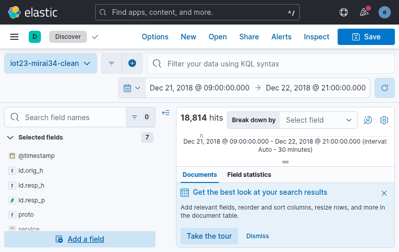
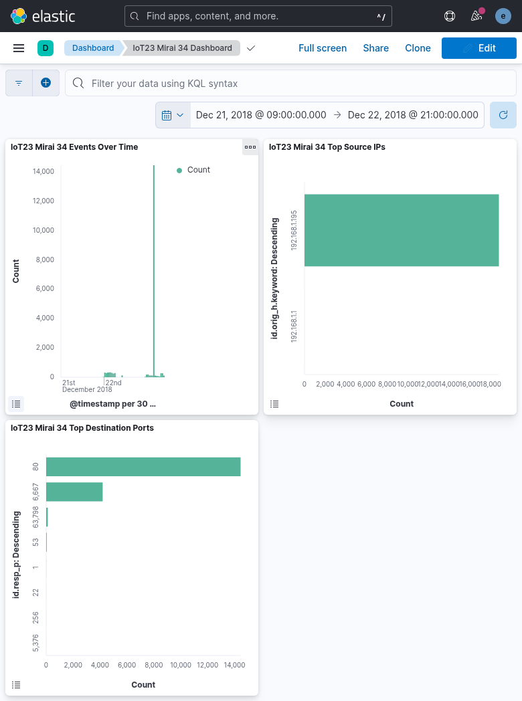

# ELKの使い方

## 目的

このドキュメントは、Kibana を使って ELK 上の Zeek `conn.log`、Cowrie `cowrie.json`、Cowrie 宛 traffic の Zeek live `conn.log` をどう読むかをまとめるものである。
IoT-23 Mirai 34 を `iot23-mirai34-clean` data view で見る静的解析の例と、`zeek-cowrie-live-*` を使う realtime attack monitoring の両方を扱う。
また、`zeek-pcap-simulation-*` を使って `dataset_id` 単位で見る運用や、`cowrie-app-*` を使って攻撃者行動を見る運用にもそのまま応用できる。

## 最初に覚える画面

最初に覚えるべき画面は 2 つだけで十分である。

- `Discover`: 生データを 1 行ずつ確認する
- `Dashboard`: 集計済みのグラフをまとめて見る

`zeek-pcap-simulation-*` を使う場合は、`dataset_id`, `batch_name`, `source_type`, `sensor_id` を追加で見るとよい。
`cowrie-app-*` を使う場合は、`eventid`, `src_ip`, `session`, `message`, `source_type`, `sensor_id` を追加で見るとよい。
`zeek-cowrie-live-*` を使う場合は、`source.ip`, `source.geo.country_name`, `source.as.organization.name`, `id.resp_p`, `proto`, `conn_state`, `source_type`, `sensor_id` を追加で見るとよい。

## `Discover` の使い方

### 最初にやること

1. 左メニューから `Discover` を開く
2. data view に `iot23-mirai34-clean` を選ぶ
3. 時間範囲を `2018-12-21` から `2018-12-22` に合わせる
4. `@timestamp`, `id.orig_h`, `id.resp_h`, `id.resp_p`, `proto`, `service`, `conn_state` を列に出す

画面例:



### 各 field の見方

- `id.orig_h`: 送信元 IP
- `id.resp_h`: 宛先 IP
- `id.resp_p`: 宛先ポート
- `proto`: プロトコル
- `service`: Zeek が推定したサービス種別
- `conn_state`: 接続状態

### よく使う検索

送信元 IP を見る:

```text
id.orig_h : "192.168.1.195"
```

宛先ポートを絞る:

```text
id.resp_p : 6667
```

サービス名で見る:

```text
service : "irc"
```

接続状態で見る:

```text
conn_state : "S0"
```

## `Dashboard` の使い方

### 最初にやること

1. 左メニューから `Dashboard` を開く
2. `IoT23 Mirai 34 Dashboard` を開く
3. 時間範囲が `2018-12-21` から `2018-12-22` になっていることを確認する

画面例:



### 各パネルの意味

- `IoT23 Mirai 34 Events Over Time`
  - いつ通信件数が増えたかを見る
- `IoT23 Mirai 34 Top Source IPs`
  - どの送信元 IP が多いかを見る
- `IoT23 Mirai 34 Top Destination Ports`
  - どのポートが多く狙われたかを見る

### 最初に見る観点

1. `Events Over Time` で攻撃が増えた時間帯を見る
2. `Top Destination Ports` で狙われているポートを見る
3. `Top Source IPs` で目立つ送信元 IP を見る
4. 気になる IP や port を `Discover` に戻って詳細確認する

## realtime Attack Monitoring dashboard の見方

### 最初にやること

1. 左メニューから `Dashboard` を開く
2. `Cowrie Live Attack Monitoring` を開く
3. 時間範囲が `Last 24 hours` になっていることを確認する
4. 自動更新が `30 seconds` になっていることを確認する

dashboard がまだ見えない場合は、先に次を実行する。

```bash
make kibana-import-cowrie-live-dashboard
```

この dashboard は `zeek-cowrie-live-*` を使い、panel 側で次の条件を前提にしている。

```text
source_type : "cowrie_live" and id.resp_p : 2222 and proto : "tcp"
```

つまり、Cowrie 宛 SSH traffic の realtime 監視専用である。
現在の scope では `cowrie-app-*` はこの dashboard に含めていない。

### 各パネルの意味

- `Cowrie Live SSH Hit Count`
  - 直近 24 時間で何件の Cowrie 宛 SSH flow が来たかを見る
- `Cowrie Live Unique Attackers`
  - 直近 24 時間で何個の送信元 IP があったかを見る
- `Cowrie Live Top Countries`
  - どの国からのアクセスが多いかを見る
- `Cowrie Live Top ASNs`
  - どの ASN / organization からのアクセスが多いかを見る
- `Cowrie Live Attack Map`
  - GeoIP 付きの送信元分布を地図で見る
- `Cowrie Live Top Source IPs`
  - どの送信元 IP からのアクセスが多いかを見る
- `Cowrie Live Events Over Time`
  - いつアクセスが増えたかを見る
- `Cowrie Live Recent Connections`
  - 直近 event を行単位で確認する

### 最初に見る観点

1. `Cowrie Live SSH Hit Count` と `Cowrie Live Unique Attackers` で全体量を見る
2. `Cowrie Live Top Countries` と `Cowrie Live Top ASNs` で発信元の大まかな偏りを見る
3. `Cowrie Live Attack Map` で public source IP の地理分布を見る
4. `Cowrie Live Top Source IPs` で目立つ送信元 IP を見る
5. `Cowrie Live Recent Connections` で `source.ip`, `id.orig_p`, `uid` を追う

補足:

- localhost からの検証では `source.ip` が private address になるため、GeoIP country / ASN / map は空でも正常である
- public source IP が入ってきたときに GeoIP/ASN panel が効いてくる

## Cowrie app log の見方

### 最初にやること

1. 左メニューから `Discover` を開く
2. data view に `cowrie-app` を選ぶ
3. `@timestamp`, `eventid`, `src_ip`, `session`, `message` を列に出す

### よく使う検索

接続 event だけ見る:

```text
eventid : "cowrie.session.connect"
```

SSH client banner を見る:

```text
eventid : "cowrie.client.version"
```

特定 session を追う:

```text
session : "e4349080b71e"
```

## Cowrie live flow の見方

### 最初にやること

1. 左メニューから `Discover` を開く
2. data view に `zeek-cowrie-live` を選ぶ
3. `@timestamp`, `source.ip`, `source.geo.country_name`, `source.as.organization.name`, `destination.ip`, `destination.port`, `proto`, `conn_state` を列に出す

### よく使う検索

Cowrie 宛 SSH を見る:

```text
id.resp_p : 2222
```

Cowrie live 由来だけに絞る:

```text
source_type : "cowrie_live"
```

接続状態で見る:

```text
conn_state : "SF"
```

## ハマりやすい点

- 時間範囲が現在時刻のままだと、IoT-23 の 2018 年データは空に見える
- `adids-zeek-conn` を使うと旧データが混ざることがある
- 実データ確認では `iot23-mirai34-clean` を使う方が分かりやすい
- Cowrie app log では localhost から接続しても `src_ip` は Docker bridge address として見える
- Cowrie live flow でも host からの接続は Docker bridge address として見える

## この session で作った object 名

- data view: `iot23-mirai34-clean`
- saved search: `IoT23 Mirai 34 Clean Events`
- visualization: `IoT23 Mirai 34 Events Over Time`
- visualization: `IoT23 Mirai 34 Top Source IPs`
- visualization: `IoT23 Mirai 34 Top Destination Ports`
- dashboard: `IoT23 Mirai 34 Dashboard`
- data view: `zeek-cowrie-live`
- saved search: `Cowrie Live Recent Connections`
- visualization: `Cowrie Live SSH Hit Count`
- visualization: `Cowrie Live Unique Attackers`
- visualization: `Cowrie Live Top Countries`
- visualization: `Cowrie Live Top ASNs`
- map: `Cowrie Live Attack Map`
- visualization: `Cowrie Live Events Over Time`
- visualization: `Cowrie Live Top Source IPs`
- dashboard: `Cowrie Live Attack Monitoring`

## 関連ドキュメント

- 構成とフロー: [ELK構成とデータフロー.md](./ELK構成とデータフロー.md)
- 可視化手順: [ELKでデータを可視化する手順.md](./ELKでデータを可視化する手順.md)
